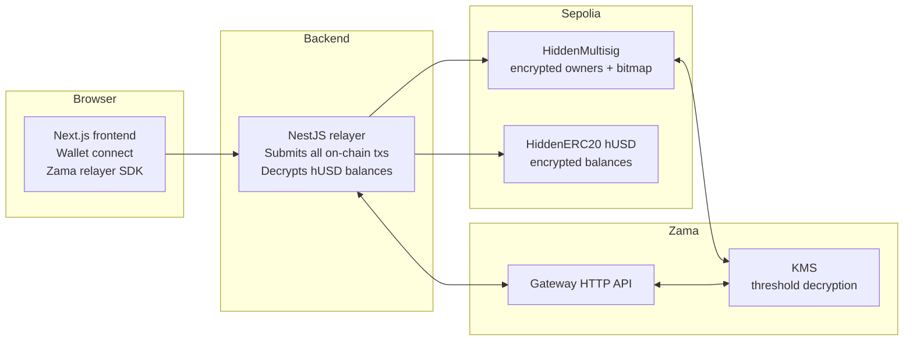

# Polypay-Zama

A confidential multisig payroll demo on Sepolia, built on [Zama Protocol](https://docs.zama.org/protocol)'s Fully Homomorphic Encryption (FHE).

Two contracts compose the privacy story:
- **HiddenMultisig** — encrypts who's in the multisig and who voted on each proposal.
- **HiddenERC20 (hUSD)** — a confidential token where balances are encrypted on-chain.

-----
- Repo: [github.com/gianalarcon/zama-polypay](https://github.com/gianalarcon/zama-polypay)
- Network: Sepolia (chainId `11155111`)
- Deployed hUSD: `0xD72DD55D40289beF71a7ef309a7DDd8208809c71`

---

## Privacy at a glance

| What | Public on Etherscan? |
|---|---|
| Multisig contract address, signer count | Yes |
| Recipient address of a payment | Yes |
| **Token balance of any address (multisig or user)** | **Hidden** (encrypted handle) |
| **Transfer amount in the hUSD `Transfer` event** | **Hidden** (event has no amount field) |
| **Identities of signers (who's in the multisig)** | **Hidden** (encrypted owner array) |
| **Who approved or denied a proposal** | **Hidden** (encrypted bitmap) |
| **Approval count vs. threshold** | **Hidden** (encrypted counter; only the met-or-not boolean is published at execute time) |
| **Demo limitation: proposal recipient + amount stored on the multisig** | **Public** — see note below |

> **Demo limitation.** `HiddenMultisig.proposeTransfer(to, amount)` stores `(to, amount)` in plaintext inside the proposal so signers can review what they're voting on. Anyone can call `multisig.getProposal(propId)` and read both. The hUSD layer itself stays fully encrypted (balance + transfer event), but the multisig leaks the proposal's (to, amount) pair. To close this leak, the proposal would need to store an encrypted amount handle and signers would have to `userDecrypt` to review — out of scope for this hackathon build.

---

## Architecture



### How the pieces fit

- **Identity = pseudonym, not wallet address.** A signer signs the message `Polypay-Zama identity v1` once with their wallet. The signature is hashed twice into a 20-byte commitment. The same wallet always re-derives the same commitment, so no backup is needed. The commitment is what the multisig stores (encrypted) and what the backend persists. The wallet address never leaves the browser.
- **HiddenMultisig.** Owners are stored as `eaddress[]` (encrypted commitments). Approving submits an encrypted commitment; the contract uses `FHE.eq` against every owner and increments an encrypted `euint8` counter only on a fresh first-time match (a per-proposal `ebool[]` bitmap prevents double-counting). When the encrypted counter reaches the threshold, the contract publishes only a met-or-not boolean for KMS to decrypt.
- **HiddenERC20 (hUSD).** Balances live as `mapping(address => euint64)`. `transfer` takes an externally-encrypted amount + ZKPoK proof. FHE arithmetic (`FHE.add` / `FHE.sub`) updates the ciphertexts on-chain. The `Transfer` event emits only `(from, to)` — no amount field at all.
- **Relayer.** A single backend EOA submits every on-chain tx so `msg.sender` never leaks a signer's wallet. The same EOA holds an FHE ACL on every hUSD balance so the backend can decrypt and show plaintext balances to authorised users in the app.

---

## Setup

### Prerequisites

- Node.js ≥ 20.18.3
- Yarn 3 (Berry, ships with the repo — nothing to install globally)
- Docker + Docker Compose
- A Sepolia wallet with ~0.1 ETH for the relayer EOA (use any [Sepolia faucet](https://sepoliafaucet.com))

### Copy-paste setup

Run these from the repo root, top to bottom. The only manual edit is pasting your relayer private key into the backend `.env` in step 5.

```bash
# 1. Clone
git clone git@github.com:gianalarcon/zama-polypay.git
cd zama-polypay

# 2. Install all workspace deps
yarn install

# 3. Build the @polypay/shared package
#    (backend + frontend import compiled artifacts; required on a fresh
#    clone because shared/dist is not committed)
yarn workspace @polypay/shared build

# 4. Start the local Postgres container
docker compose -f docker/docker-compose.yml up postgres -d

# 5. Create the backend .env from the template, then paste in your key
cp packages/backend/.env.example packages/backend/.env
# Open packages/backend/.env and replace 0xYOUR_RELAYER_PRIVATE_KEY with
# the private key of your funded Sepolia EOA. DATABASE_URL is already filled.

# 6. Apply DB migrations + generate Prisma client
#    (`prisma migrate dev` runs `prisma generate` automatically; you only
#    need a separate `prisma:generate` if the schema didn't change but the
#    Prisma client did, e.g. after a `yarn install`.)
yarn workspace @polypay-zama/backend prisma:migrate
```

> Frontend has no `.env` — Sepolia public RPC, hUSD address, and a demo Wallet-Connect project ID all default in code.

> The deployed shared hUSD is `0xD72DD55D40289beF71a7ef309a7DDd8208809c71`; you don't need to deploy contracts to run the demo.

### Run

Two terminals:

```bash
# terminal 1 — backend (NestJS, http://localhost:4000)
yarn start:backend

# terminal 2 — frontend (Next.js, http://localhost:3000)
yarn start:frontend
```

Open `http://localhost:3000` and follow the [end-to-end demo](#end-to-end-demo) below.

### Production build (optional)

The dev commands above run with hot-reload. To build production bundles:

```bash
yarn build
```

Builds `@polypay-zama/backend` and `@polypay-zama/frontend` into their respective `dist/` and `.next/` directories. (`@polypay/shared` was already built in step 3.)

### Deploying your own contracts (optional)

Skip this unless you need a fresh hUSD instance — the deployed one above is shared.

```bash
cp packages/hardhat/.env.example packages/hardhat/.env
# Set DEPLOYER_PRIVATE_KEY (Sepolia EOA with gas) and
# RELAYER_ADDRESS (same EOA the backend uses as RELAYER_PRIVATE_KEY).

yarn compile
yarn deploy:sepolia --tags HiddenERC20

# Copy the printed address into packages/shared/src/contracts/husd-config.ts,
# then rebuild shared so backend/frontend pick up the new address:
yarn workspace @polypay/shared build
```

---

## End-to-end demo

> Easiest with two browser profiles so you can play signer A and signer B.

1. Open http://localhost:3000, connect wallet (Sepolia).
2. Click **Generate Membership ID**, sign `Polypay-Zama identity v1` in MetaMask. Your commitment lands in `localStorage`.
3. Go to `/dashboard/new-account`, name the account, add yourself + a second signer's commitment, set threshold (e.g. 2-of-2), Create. Wait ~30–60 s for FHE encrypt + deploy + initialize.
4. `/mint`, tab **Mint to wallet**: enter `1000`, Mint. Wallet balance card flips once the relayer can decrypt it.
5. `/mint`, tab **Deposit to multisig**: enter `100`, Deposit. The browser FHE-encrypts the amount and your wallet signs the prepared `hUSD.transfer(multisig, encAmount, proof)` call.
6. `/transfer`: recipient + amount, Submit Proposal. Backend submits and auto-approves on your behalf.
7. Switch to signer B's wallet, reload, Approve the proposal. Realtime WebSocket pushes the vote — the row updates without a refetch.
8. With the threshold met, click **Execute**. Three on-chain steps run: `requestExecute` → KMS public-decrypt → `finalizeExecute` (which dispatches `hUSD.transfer` with a freshly encrypted amount).
9. The row flips to a **Succeed** badge linking to Etherscan.
10. Verify on Etherscan: the hUSD `Transfer` event has no amount; balances all read as ciphertext handles. Open the multisig contract → you'll see the proposal's plaintext `(to, amount)` if you call `getProposal(propId)` (the demo limitation called out above).

---

## Tech stack

- **Frontend**: Next.js 15, React 19, RainbowKit 2, wagmi 2, viem 2, `@zama-fhe/relayer-sdk` (web), Tailwind CSS 4, TanStack Query 5, Zustand.
- **Backend**: NestJS 11, Prisma 5 + Postgres, ethers 6, `@zama-fhe/relayer-sdk` (node), socket.io.
- **Contracts**: Solidity 0.8.27, `@fhevm/solidity`, Hardhat + hardhat-deploy.
- **Network**: Sepolia (Zama Protocol's only supported testnet at time of writing).

---

## Limitations

- **Sepolia only.** Zama FHE coprocessor + KMS aren't on mainnet yet.
- **Recipient address stays public.** EVM transfers need a plaintext destination to update storage. Hiding the recipient too would need a stealth-address scheme — out of scope.
- **Proposal amount + recipient are public.** Stored in plaintext on the multisig (see demo limitation above). The hUSD `Transfer` event itself stays encrypted; only the multisig's proposal record leaks.
- **Relayer is a trusted operator.** It holds an FHE ACL on every balance, so it can decrypt any user's hUSD. Acceptable for a demo; production would split this across a multi-party operator.
- **Latency.** Each on-chain action is bounded by a Sepolia block (~12 s) plus FHE encrypt + ZKPoK proof generation (~5–15 s). Propose → execute end-to-end is ~60–90 s.
- **Balance read takes 2–4 s.** It does an `eth_call` to `balanceOf` plus a Zama Gateway + KMS userDecrypt round-trip.
- **No batch transfers.** A proposal moves one recipient at a time.

---

## Repo layout

```
packages/
├── hardhat/        Solidity (HiddenMultisig.sol, HiddenERC20.sol) + deploy scripts
├── backend/        NestJS relayer (REST + WebSocket), Prisma schema, FHE helpers
├── nextjs/         Frontend — /dashboard, /transfer, /mint, /dashboard/new-account
└── shared/         Cross-package types, DTOs, contract artifacts (ABI + bytecode + addresses)
```

---

## Disclaimer

Hackathon code, not audited. The relayer EOA is a single point of trust. Don't use mainnet funds. Forked from the original [Polypay](https://github.com/Poly-pay/polypay_app) (zkVerify + Horizen) and rewritten for Zama Protocol.
